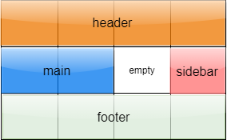

:::tip
学习CSS grid的小游戏：https://cssgridgarden.com/
:::
## 1. 基本概念
在了解Grid布局之前，需要了解相关概念

### 1.1 网格容器与网格元素
设定了`display:grid`的元素为 网格容器，其**直接子元素**为 网格元素。

```css
<div id="container">
	<div class="item1"><p>Grid1</p></div>
    <div class="item2"><p>Grid2</p></div>
    <div class="item3"><p>Grid3</p></div>
    <div class="item4"><p>Grid4</p></div>
</div>
```
上述代码中，`div#container` 为网格容器， `div.item`为网格元素。
`p`标签元素不是网格元素。

### 1.2 网格线、网格单元、网格路径和网格区域
划分网格的线成为网格线，网格线有<u>横向网格线</u>和<u>纵向网格线</u>。例如`m * n`的网格区域，表示的是有 m 行 n 列的网格，具有 m + 1 条横向网格线，n + 1 条纵向网格线。

被网格线分隔出来的一块块区域，称为**网格单元**。

两条同系列的相邻网格线之间的区域，称为**网格路径**。

由网格单元组成的区域，称为**网格区域**。

## 2. 属性

Grid布局具有两种属性，一种定义在网格容器上面，称为**容器属性**；另一种定义在网格元素上，称为**元素属性**。

::: details
|容器属性|元素属性|
|:------|:------|
|display|grid-column-start
|grid-template-columns|grid-column-end
|grid-template-rows|grid-row-start
|grid-template-areas|grid-row-end
|grid-template|grid-column
|grid-column-gap|grid-row
|grid-row-gap|grid-area
|grid-gap|justify-self
|justify-items|align-self
|align-items|place-self
|place-items||
|justify-content||
|align-content||
|place-content||
|grid-auto-columns||
|grid-auto-rows||
|grid-auto-flow||
|grid||
:::


## 3. 容器属性

### 3.1 display属性
有两个值：
- `display: grid` 指定元素为网格布局，默认为块级元素。

- `display: inline-grid`,设定为行内元素的网格布局。

::: warning
设定为网格布局后，网格元素的 `float`, `display:inline-block`, `display:table-cell`, `vertical-align` 和 `column-*`等属性的设置都会失效。
::: 

> 注：网格布局允许嵌套 

### 3.2 grid-template-columns、grid-template-rows

俩属性都是用来对网格单元的设置。
- 可以是具体的长度，百分比或者网格元素中那些剩余空间的部分（可以用单位fr来表示）。
- 可以对网格线进行命名。

```css
#container {
    display: grid;

    /* 数值或百分比及fr */
    grid-template-columns: 40px 50px 50px 1fr 2fr;/* 这里fr单位的设置表示为 设置完前面三列的剩余空间平均分成3份，第四列占1份第五列占2份 */
    grid-template-rows: 25% 100px auto;

    /* 定义网格线名称 */
     grid-template-rows: [row1-start] 25% [row1-end row2-start] 25% [row2-end];/* 每条网格线可以不只有一个名字*/

    /* repeatd定义 */
    grid-template-columns: repeat(3, 20px [col-start]);
    /* 等价于↓ */
    grid-template-columns: 20px [col-start] 20px [col-start] 20px [col-start];/* 若网格线名字相同，可用名称加数字的形式区分,例如 col-start 2 */

}
```

### 3.3 grid-template-areas
对网格区域进行命名，方便元素确定位置。
三种值：
- 具体的名字,对于网格区域的命名
- `.` 表示该网格区域为空
- `none` 没有网格区域被定义

```css
/* 容器 */
#container{
    display: grid;
    grid-template-columns: 50px 50px 50px 50px;
    grid-template-rows: auto;
    grid-template-areas: 
        "header header header header"
        "main main . sidebar"
        "footer footer footer footer"; 
}

/* 元素 */
.item1 {grid-area: header;}
.item2 {grid-area: main;}
.item3 {grid-area: sidebar;}
.item4 {grid-area: footer;}

```


### 3.4 grid-template
该属性是设置`grid-template-rows` `grid-template-columns`和`grid-template-areas`三个属性的缩写。
可以有两种值：
- none,设置所有属性值为默认值
- `<grid-template-rows>` / `<grid-template-columns>`,设置相应的数值，但把`grid-template-areas`设置为 `none`

但是也可以接受嵌套的复杂设置，如下：
```css
#container {
    grid-template:
    [row1-start] "header header header" 25px [row1-end]
    [row2-start] "footer footer footer" 25px [row2-end]
    / auto 50px auto;

    /* 等价于↓ */

    grid-template-rows: [row1-start] 25px [row1-end row2-start] 25px [row2-end];
    grid-template-columns: auto 50px auto;
    grid-template-areas: 
        "header header header"
        "footer footer footer";
}
```

### 3.5 [column | row | grid-column | grid-row]-gap
定义网格线的尺寸，也就是定义网格单元之间的间隔。值为具体的数值

`cloumn-gap`与`grid-column-gap`属性相同,`row-gap`与`grid-row-gap`属性相同。

### 3.6 grid-gap | gap
设置`row-gap`和`column-gap`的缩写，以空格分隔。

- `<grid-row-gap>` `<grid-column-gap>`

### 3.7 justify-items 和 align-items

`justify-items`在水平方向上，对于网格元素进行的定位。该属性将应用在所有容器内的网格区域中。
`align-items`在竖直方向上，对于网格元素进行的定位。该属性将应用在所有容器内的网格区域中。

- start，将网格元素在每个网格单元的起始网格线对齐
- end, 将网格元素在每个网格单元的终止网格线对齐
- center, 将网格元素在每个网格单元的中心对齐
- stretch, 默认值，将网格元素在规定的方向填充整个网格单元

```css
#container {
    justify-items: start | end | center | stretch;

    align-items: start | end | center | stretch;
}
```

### 3.8 place-items

同时设置 `align-items` 和 `justify-items`两个属性的简写
- `<align-items>` / `<justify-items>` 

### 3.9 justify-content 和 align-content

当整个网格的大小要小于元素容器的大小时，这两个属性负责对所有的网格元素在容器内部进行对应方向上的排布。
`justify-content`定义水平方向上的排布，`align-content`定义竖直方向上的排布。

- start，将整个网格排布的起点设定为对应方向上网格容器的起始边缘
- end，将整个网格排布的终点设定为对应方向上网格容器的终止边缘
- center，将整个网格排布的中心设定为对应方向上网格容器的中心
- stretch，调整网格元素的尺寸大小，允许网格可以充满指定的方向(对于指定固定长度的网格区域无效)
- space-around，将剩余空间均分在网格区域的对应方向上，网格容器与第一个网格区域之间的空间占网格区域之间空间的一半
- space-between，将剩余空间均分在各个网格区域之间，网格容器与第一个网格区域之间没有空间
- space-evenly，将剩余空间均分在网格区域的对应方向上，网格容器与第一个网格区域之间的空间与网格区域之间空间相等

```css
#container {
    align-content: start | end | center | stretch | space-around | space-between | space-evenly;    
}
```

### 3.10 place-content

同时设置 `align-content` 和 `justify-content`两个属性的简写

- `<align-content>` / `<justify-content>` 


## 4. 元素属性

### 4.1 [grid-column | grid-row]-[start | end]

- 网格线名，默认为数字，起始为1，可以为负值
- span 数字，表示可以穿过的网格单元的个数
- span 网格线名，穿过网格单元直到遇到网格线名
- auto

```css
.item {
  grid-column-start: <number> | <name> | span <number> | span <name> | auto;
  grid-column-end: <number> | <name> | span <number> | span <name> | auto;
  grid-row-start: <number> | <name> | span <number> | span <name> | auto;
  grid-row-end: <number> | <name> | span <number> | span <name> | auto;
}
```

### 4.2 grid-row 和 grid-column

简写形式
- `<start-line>` / `<end-line>`

### 4.3 grid-area
- 若网格容器设置了`grid-template-areas`属性，则`grid-area`可以指定对应的值
- `<row-start>` / `<column-start>` / `<row-end>` / `<column-end>`

## 结尾
> 本文介绍了大部分的属性，但是实在是找不到合适的画图软件来展示对应的效果。图就先欠着吧:joy: 另外截至写文的时间，W3C对于Grid布局的标准已经到了CR的阶段，更新时间为2020-10-21，不知道是不是以后这种布局会不会大量运用。让我们拭目以待吧！:smile:

参考资料：
- [A Complete Guide to Grid](https://css-tricks.com/snippets/css/complete-guide-grid/),CSS-Tricks
- [CSS Grid 网格布局教程](http://www.ruanyifeng.com/blog/2019/03/grid-layout-tutorial.html),阮一峰
- [CSS Grid Layout Module Level 1](https://www.w3.org/TR/2020/CRD-css-grid-1-20201021/), W3C