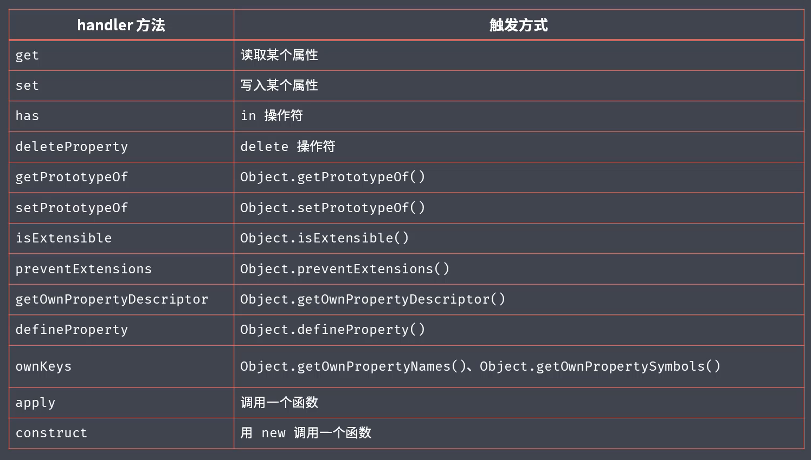

实际上 JavaScript 是 ECMAScript 的扩展语言

ECMAScript 只是语言规范

从2015年开始 ES 保持每年一个版本的迭代，ECMAScript 2015 通常被称为 ES6

JavaScript @ Web = ECMAScript + Web API（BOM + DOM）

JavaScript @ Node = ECMAScript + Node API （fs, net, ......)


## let 、 const

新加入的 let 和 const 声明方式，让声明的成员只能在声明的块中生效。

不允许重复声明，且声明后才能使用，不会有变量提升的问题。

解决了 for 循环中的用var声明的变量无法获得理想中数值的问题。

另外，即使在全局作用域中用 let 和 const 声明变量，该变量也不会挂在 global 对象上。


对比于 let， const最明显的区别在于，const 声明变量的同时必须要赋值。const 要求内层指向不允许被修改，但对于数据成员的修改没有问题。


对于变量提升：

let、const   创建提升  初始化和赋值均不提升

var 创建提升，初始化提升，赋值不提升

function 创建，初始化，赋值均提升


## 解构赋值

### 数组的解构

```js
 const arr = [1,2,3];

 const [a, b, c] = arr;
 console.log(a, b, c); // 1,2,3

 const [,,last] = arr;
 console.log(last); // 3

 const [a, b, c, d, e = 'hello'] = arr;
 console.log(d, e); // undefined, 'hello'

```


### 对象的解构

```js
 cosnt obj = {name: 'hello', age: 24};

 // 对象解构赋值 参数必须与对象的key值相同
 const {name} = obj;
 console.log(name); // 'hello'

 //设置自定义名称
 const {name: objName} = obj;
 console.log(objName); // 'hello'

 const {log} = console;
 log('hello')
```


## 模板字符串

用反引号包裹，其中可使用插值表达式`${name}`,插值表达式中可以进行操作。


### 带标签的模板字符串

```js
 const name = 'Lucy';
 const gender = false;
 
 function myTag(strings, name, gender) {
     const sex = gender ? 'Man' : 'Woman';
     return strings[0] + name + strings[1] + sex + string[2];
 }

 const result = myTag`he, ${name} is a ${gender}.`;

 console.log(result);
```


 

##  字符串三个扩展方法

```js
 const str = 'hello, today is friday!';

 console.log(str.startsWith('h')); //true
 console.log(str.endsWith('!')); // true
 console.log(str.includes('i')); // true
```


## 函数参数的默认值

```js
 // 默认值放在形参的最后
 function hello(name, age = 18){
     console.log(`${name}'s age is ${age}`);    
 }

 hello('tom');
```


## 剩余参数

```javascript
 function list(first, ...args){
     console.log(args);
 }

 list(1,2,3,4,5,6);
```


## 箭头函数

箭头函数的 this 值为定义该箭头函数的上下文，不会随者调用的改变而改变。

书写方便


## 对象

### 对象字面量

```js
 const name = 'hello';

 const obj = {
     bar: 123,
     // 属性名称与变量名称相同可以省略
     name,
     // 方法可以省略 function
     method1 () {
         console.log(this.bar)
     },
     // 通过 [] 的方式让表达式的结果称为属性名
     [parseInt('45he')]: 345
 }
```


### Obj.assign 方法

`Obj.assign(target, source1, source2);` 该方法接收三个参数均为对象，第一个参数位为基准，后续跟target 属性相同的则覆盖，缺少的则添加。

通常用来通过空对象，复制对象。

```js
 const obj = {name: 'luke', age: 25};

 function f(obj){
     // 复制该对象 不会对外部的obj产生影响
     const fobj = Object.assign({}, obj);
     fobj.name = 'tom';
     console.log(fobj);
 }

 f(obj);
 console.log(obj);
```


### Object.is 方法

```js
 console.log(
 	0 === false, // false
    0 == false,  // true
    +0 === -0,   // true
    NaN === NaN,  // false
    Object.is(NaN, NaN), // true
    Object.is(+0, -0)   // false
 )
```


## Proxy 对象

一个监视器对象，方便对 对象的操作进行处理，对比于 `Object.defineProperty()`方法优势：

- 可以监视读写以外的操作
- 可以很方便的监视数组的操作，不用重新定义数组内置的方法来进行监视
- 不需要侵入对象

```js
 const person = {
     name: 'luke',
     age: 18
 }
 
 const personProxy = new Proxy(person, {
     // 监视获取属性
     get(target, property){
         console.log(target, property);
         return property in target ? target[property] : 'default';
     },
     
     // 监视设置属性
     set(target, property, value){
     	if(property === 'age'){
            if(!Number.isInteger(value)){
                throw new TypeError(`${value} is not an int`);
            }
        }
     	target[property] = value;
 	 }
 });

 personProxy.age = 100;
 personProxy.gender = 'man';

 console.log(person);
```


Proxy 中能够监视的方法如下：




## Reflect 对象

Reflect 对象，主要是对操作对象提供统一的操作方式。操作方式的方法，跟Proxy中能监视的方法一致，如上图

```js
 const obj = {
     name: 'luke',
     age: 18
 }
 
 console.log('name' in obj)
 console.log(delete obj['age'])
 console.log(Object.keys(obj))

 // 上述方式与下面方法结果一致
 console.log(Reflect.has(obj, 'name'))
 console.log(Reflect.deleteProperty(obj, 'age'))
 console.log(Reflect.ownKeys(obj))
```


## Class 关键字对类的声明

在ES6 之前都是通过定义函数，以及设定函数的原型对象来实现 类。

ES6 提供了 Class的方式实现，更简洁

```js
 function Person(name){
     this.name = name;
 }
 Person.prototype.say = function(){
     console.log(`hello ${this.name}`);
 }

 // 等价于
 class Person{
     constructor(name){
         this.name = name;
     }
     
     // 实例方法，必须通过定义的实例调用 
     say() {
         console.log(`hello ${this.name}`)
     }
     
     // 静态方法，可以类型本身去调用
     static create(name){
         return new Person(name);
     }
 }

 // extend 继承方法
 class Student extends Person{
     constructor(name, age){
         super(name); // 父类构造函数
         this.age = age;
     }
     
     hello(){
         super.say(); // 调用父类成员
         console.log(`i am ${this.age} years old`);
     }
 }

 const a = new Student('tom', 25);
 a.hello();
```


## Set 数据结构

类似于数组的结构，不会存在重复值，可以用来数组去重

```js
 const s = new Set();
 
 // 添加值，可链式调用
 s.add(1).add(2).add(3)

 console.log(s.size)
 console.log(s.has(100))
 console.log(s.delete(2))
 
 // 清空
 s.clear()

 // 数组去重
 const arr = [1,2,3,4,2,3];
 const result = [...new Set(arr)];
```


###  WeakSet

Set 结构还有一个 “弱版本” WeakSet

当 Set 中对使用的数据产生了引用，即使该数据在外面被消耗掉，但是由于 Set引用了这个数据，所以依然没办法被回收。

而 WeakSet中的值只能是 Object 或者继承自Object的类型。

WeakSet结构不会对外部数据有引用，该数据在外面被消耗掉，也不会阻止回收。

因为 WeakSet 中的值任何时候都可能被销毁，所以没必要提供迭代其值的能力，即不可能在不知道对象的引用的情况下从 WeakSet中取得值


## Map 数据结构

该结构 类似于 Object，区别于 Object只能用 数值、字符串 和 Symbol 作为键值。Map可以用JavaScript中任何数据类型做为键值。

```js
 const m = new Map();
 
 const tom = {name: 'tom'};

 // 设置值
 m.set(tom, 90)
 // 获取值
 m.get(tom)

 // 查找 删除 清空
 m.has()
 m.delete()
 m.clear()

 // 可迭代
 m.forEach((value,key) => {
     console.log(value, key)
 })

```


## WeakMap

类似于 WeakSet 对比于 Set， Map也有对应的 “弱版本” WeakMap

WeakMap 中的键值 只能是 Object，或者继承自 Object 的类型。

也不会对外部引用的对象产生正式的引用，所以不会阻止垃圾回收机制

WeakMap中的键值也不可迭代


## Symbol 类型

对于同一个对象在不同位置进行修改时，难免出现修改成了相同的值，为避免这种情况 ES6 新加入Symbol的数据类型。

该类型最大特点是 独一无二。从ES6 开始，Object 可以使用 Symbol 作为键值。

**目前该值最主要的作用是给对象创建一个独一无二的键值** 

```js
 // 两个Symbol永远不相等
 const s1 = Symbol();
 const s2 = Symbol();
 console.log(s1 === s2); // false

 const a1 = Symbol('a');
 const a2 = Symbol('a');
 console.log(a1 === a2); // false
 
 // 可以模拟实现对象的私有成员
 // 在对象外部没办法声明一个 相同的 Symbol 所以成为了私有变量
 const name = Symbol();
 const obj = {
     [name] : 'luke',
     age: 18,
     say(){
         console.log(this[name])
     }   
 }
 
 obj.say();
 
```


> 目前 Javascript 中一共有 7 种数据类型：undefined，null，String，Number，Boolean，Symbol，Object；<br>
>
> 未来将会添加 BigInt 类型用来存放长数值。


### Symbol补充

Symbol.for方法，可以通过字符串的设置，定义相同的Symbol值

```js
 const s1 = Symbol.for('foo');
 const s2 = Symbol.for('foo');

 console.log(s1 === s2); // true
```


 Symbol 内置常量，可以作为内部方法的标识

```js
 console.log(Symbol.iterator)
 console.log(Symbol.hasInstance)

 const obj = {
   [Symbol.toStringTag]: 'XObject'
 }
 console.log(obj.toString())
```


Symbol 属性名获取

```js
 const obj = {
   [Symbol()]: 'symbol value',
   foo: 'normal value'
 }

 for (var key in obj) {
   console.log(key) // 获取非Symbol属性名
 }
 console.log(Object.keys(obj)) // 获取非Symbol属性名
 console.log(JSON.stringify(obj)) // 获取非Symbol属性名

 console.log(Object.getOwnPropertySymbols(obj)) // 获取Symbol属性名
 console.log(Object.getOwnPropertyNames(obj)) // 获取非Symbol属性名
 console.log(Reflect.ownKeys(obj)); // 获取所有的属性名
```


## for-of 循环

遍历数组

```js
const arr = [100, 200, 300, 400];
for(const item of arr){
	console.log(item);
    if(item > 200){
        break; // 可以中止遍历
    }
}
```

遍历 Set 和 Map

```js
const s = new Set(['hello', 'today'])
for(const item of s){
    console.log(item);
}

const m = new Map()
m.set('foo', '123')
m.set('bar', '345')

for (const [key, value] of m) {
  console.log(key, value)
}
```


**普通对象不能被直接遍历**


## iterator 可迭代接口

可迭代的类型，都在原型上具有 `Symbol.iterator ` 方法

可迭代的类型中的 Symbol.iterator 方法返回的是一个带有 next 方法的对象，调用next方法，返回的是一个含有该类型内部数据的对象，其中的 done 属性，判断迭代是否完成。

```js
const set = new Set(['foo', 'bar', 'baz'])

const iterator = set[Symbol.iterator]()

console.log(iterator.next())
console.log(iterator.next())
console.log(iterator.next())
console.log(iterator.next())

while(true){
    const cur = iterator.next();
    if(cur.done === true){
        break;
    }
    console.log(cur.value);
}
```


### 实现可迭代接口

迭代器模式，对外提供统一接口。可以对任意数据结构实现可迭代。

```js
const obj  = { // 最外层可迭代接口 Iterable
    store: ['hello', 'today', 'friday'],
    [Symbol.iterator]: function() {
        let index = 0;
        const self = this;
        return { // 迭代器接口 Iterator
            next: function(){
                const res =  { // 迭代结果接口 IterationResult
                    value: self.store[index],
                    done: index >= store.length
                }
                index++;
                return res;
            }
        }
    }
}
```


## Generator 生成器函数

```js
function * foo () {
  console.log('1111')
  yield 100
  console.log('2222')
  yield 200
  console.log('3333')
  yield 300
}

const generator = foo()

console.log(generator.next()) // 第一次调用，函数体开始执行，遇到第一个 yield 暂停
console.log(generator.next()) // 第二次调用，从暂停位置继续，直到遇到下一个 yield 再次暂停
console.log(generator.next()) // 。。。
console.log(generator.next()) // 第四次调用，已经没有需要执行的内容了，所以直接得到 undefined

```


### Generator 使用场景

1.  发号器

```js
function * createIdMaker () {
  let id = 1
  while (true) {
    yield id++
  }
}

const idMaker = createIdMaker()

console.log(idMaker.next().value)
console.log(idMaker.next().value)
console.log(idMaker.next().value)
console.log(idMaker.next().value)
```

2. 实现 iterator 方法

```js
const todos = {
  life: ['吃饭', '睡觉', '打豆豆'],
  learn: ['语文', '数学', '外语'],
  work: ['喝茶'],
  [Symbol.iterator]: function * () {
    const all = [...this.life, ...this.learn, ...this.work]
    for (const item of all) {
      yield item
    }
  }
}

for (const item of todos) {
  console.log(item)
}
```


## ECMAScript 2016 添加内容

- 添加 Array.prototype.includes 方法
- 添加指数运算符  2 ** 10


## ECMAScript 2017 添加内容

- Object.values() 方法，返回对象中所有值组成的数组
- Object.entries() 方法， 通过数组的形式返回对象
- Object.getOwnPropertyDescriptors 获取对象中完整的塑像描述信息

- String.prototype.padStart / String.prototype.padEnd ，用给定字符串去填充指定字符串的开始或者结尾位置，直到达到指定的长度为止
- 函数参数中添加尾逗号